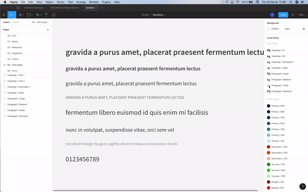

# Happy UI Sync

This Figma plugin helps sync design and code.

Export local styles from your Figma project to your project repository

## How to use



### Requirements for the Figma plugin user

- A Github account with access to the repo you want to be able to edit
- [A personal access token](https://help.github.com/en/github/authenticating-to-github/creating-a-personal-access-token-for-the-command-line) for that github account

#### Formats to use for designers and devs

##### @Desginer 👨‍🎨 — Local styles format in Figma

Define colors in "Local Styles > Color Styles"

Examples :

- "Primary / 700"
- "Primary / 300"
- "Primary / 100"
- "Color Name / Variant"

Rules :

- The color name and variant must be separated by the following characters " / " (don't forget the space before and after)
- Use Figma "Solid" type for colors (you can set the color opacity)

#### @Developer 🧑‍💻 — Variables format in code

For now, this plugin only handles json format.

- All color names are camelcased.
- Colors are stored in rgba format

```json
// colors.json
{
  "primary": {
    "300": "rgba(223, 242, 240, 1)",
    "500": "rgba(165, 240, 245, 1)",
    "700": "rgba(82, 203, 242, 0.58)"
  },
  "colorName": {
    "variant": "rgba(229, 231, 250, 1)"
  }
}
```

Import that file in your stylesheet and enjoy!

## @Desginer 👨‍🎨 & @Developer 🧑‍💻 — Installation

### 1) Build

As the plugin is not published yet, you can only use it in Figma Development mode.

You need the developer's hand to first build the plugin and provide a folder with the plugin files.

To build the plugin:

```
    yarn
    yarn build
```

You should end up with a folder containing:

- `manifest.json` file
- `dist/` folder

### 2) Add the plugin to your Figma desktop app

Then open your Figma desktop app, in the menu, select "Plugin > Development > New Plugin".

In the "Create a plugin" console, choose "Link existing plugin" and select the manifest.json from the previous folder.

Then you can open the plugin from the Menu "Plugin > Development".

Use the "Open console" from "Plugin > Development" to debug

### @Developer 🧑‍💻 — Build the plugin in dev mode

```bash
    yarn
    yarn start
```

This starts a watch process so you can edit the code. The figma plugin installed will update automatically when you run it again.
